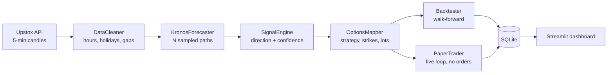

<div align="center">

# 📈 Kronos Options

**An AI signal engine for Indian index options.**
A candlestick foundation model forecasts NIFTY, BANKNIFTY and SENSEX. Those forecasts become concrete option trades, priced with real historical option data and realistic costs.


-7C3AED)


[](https://github.com/rajmaurya0904/kronos-options/actions/workflows/tests.yml)

</div>

---

## What it does

Most retail "signals" are an indicator crossing a line. Kronos Options asks a different question: **given the last 400 five-minute candles, what is the *distribution* of where the index goes in the next hour?**

1. [**Kronos**](https://github.com/shiyu-coder/Kronos), a foundation model for financial candlesticks, samples several possible future paths.
2. The signal engine reads that cloud of paths: how many end higher, how far they move, and how spread out they are.
3. The options mapper turns the reading into a trade: strategy, strikes and lot size.
4. Everything is checked against real option prices and a full Indian cost model, in a backtest or in a live paper-trading loop.

It does not always trade. The neutral zone is deliberately wide, so the engine would rather miss a trade than force one.

## How it works



### From forecast to signal

The engine requires probability and magnitude to agree before going directional. A high up-probability with a tiny expected move stays `NEUTRAL`.

| Signal | `prob_up` | Expected move |
|---|---|---|
| `STRONG_BULLISH` | ≥ 0.75 | ≥ +0.50% |
| `BULLISH` | ≥ 0.65 | ≥ +0.25% |
| `NEUTRAL` | everything else | everything else |
| `BEARISH` | ≤ 0.35 | ≤ −0.25% |
| `STRONG_BEARISH` | ≤ 0.25 | ≤ −0.50% |

Confidence is `0.6 × conviction + 0.4 × magnitude`. Conviction is how far `prob_up` sits from 0.5, and magnitude is the expected move capped at 1%. The spread of the sampled paths sets the **dispersion regime**, and live implied volatility sets the **IV regime**.

### From signal to trade

| Signal | Regime | Default strategy |
|---|---|---|
| `STRONG_BULLISH` | – | Buy ATM CE |
| `BULLISH` | – | Bull put spread |
| `NEUTRAL` | high dispersion, low IV | Long straddle |
| `NEUTRAL` | low dispersion, high IV | Iron condor |
| `BEARISH` | – | Bear call spread |
| `STRONG_BEARISH` | – | Buy ATM PE |

Every threshold and strategy choice lives in [`config.yaml`](config.yaml), so you can tune them without touching code.

## Features

- 🧠 **Probabilistic forecasts.** Several sampled paths per bar, so you get a distribution and not a single guess.
- 🎯 **Three instruments.** NIFTY, BANKNIFTY and SENSEX, each with its own lot size, strike step and expiry day.
- 🧾 **Real option prices.** The backtester prices every leg at the real entry minute and the real exit minute from Upstox's expired-instruments 1-minute candles, using each contract's own lot size. If any leg has no data, the whole trade falls back to Black-Scholes and is tagged `bs_approximation`, so you can filter those out. A trade is never half real, half modelled.
- 💸 **Honest costs.** Per leg, on actual buy and sell turnover: brokerage, STT (0.15% on sells since April 2026), exchange charges, GST, SEBI fees, stamp duty and one tick of slippage each way. The backtester and paper trader share one cost model.
- 🛡️ **Risk rules built in.** No trades in the first 5 minutes, none after 15:15, a hard 15:15 square-off, skipped expiry days (read from the broker's real expiry list) and skipped event days from a configurable calendar.
- 📊 **Streamlit dashboard** with four pages: Live Forecasts, Today's Signals, Paper P&L and Backtest Results.
- 🔌 **Broker-agnostic.** Upstox is the primary broker, behind a small interface. A Zerodha stub is included.
- 🔒 **Four-lock live mode.** Off by default (see [Live trading safety](#-live-trading-safety)).
- ✅ **Tested in CI.** Unit tests for the utilities, data cleaner, signal engine, expiry detection and cost model run on every push via GitHub Actions.

## Quick start

> Runs on CPU. No GPU needed. Kronos-small is 24.7M parameters and fits comfortably in 8 GB of RAM.

**1. Clone and install**

```bash
git clone https://github.com/rajmaurya0904/kronos-options.git
cd kronos-options
pip install -r requirements.txt
```

**2. Install the Kronos model code** (a separate repo; the weights download from Hugging Face on first run)

```bash
git clone https://github.com/shiyu-coder/Kronos
cd Kronos && pip install -r requirements.txt
```

**3. Add credentials**

```bash
cp .env.example .env     # on Windows: copy .env.example .env
```

Then fill in `.env`:

| Variable | What |
|---|---|
| `UPSTOX_ACCESS_TOKEN` | Your Upstox token (refresh it each morning before 09:15) |
| `KRONOS_REPO_PATH` | Full path to the Kronos folder you just cloned |

**4. Initialise and test**

```bash
python -c "from src.db import init_db; init_db()"
pytest tests/ -v
```

## Usage

### Run a backtest

```bash
python run_backtest.py --symbol NIFTY --start 2026-05-01 --end 2026-06-09
python run_backtest.py --symbol BANKNIFTY --start 2025-06-01 --end 2025-12-31 --lots 2
```

It prints trades, win rate, total P&L, average win and loss, profit factor, Sharpe and max drawdown. It also warns you what share of trades fell back to Black-Scholes. Sharpe is computed over every session in the test, including days with no trade, so idle days are not dropped from the ratio.

To keep only the trades priced from real option data:

```python
real = result["trade_log"][result["trade_log"]["data_source"] == "real_option_data"]
```

### Run the paper trader (market hours)

```bash
python -m src.paper_trader --symbols NIFTY BANKNIFTY
```

It wakes just after every 5-minute bar closes, combines cached history with today's intraday candles, and only uses completed bars. Then it forecasts, signals, maps and logs a paper trade, but only when every leg has a live price. It marks open positions to market after costs and squares everything off at 15:15. **No orders are ever sent.**

### Open the dashboard

```bash
streamlit run dashboard/app.py
```

Then visit <http://localhost:8501>.

## Configuration highlights

| Area | Key settings (`config.yaml`) |
|---|---|
| Model | `kronos.lookback: 400` bars in, `pred_len: 12` bars out (1 hour), `samples: 5`, `temperature: 1.0`, `top_p: 0.9` |
| Session | `09:15–15:30` IST, no new trades after `15:15`, `skip_expiry_day: true` |
| Sizing | `paper_trading.capital_per_trade: 50000`, `max_open_positions: 3` |
| Instruments | NIFTY (lot 65, weekly Tue expiry), BANKNIFTY (lot 30, monthly last-Tue expiry), SENSEX (lot 20, weekly Thu expiry) |
| Costs | ₹20 per order, STT 0.15% on sell premium, exchange charge 0.03553% (NSE) / 0.0325% (BSE), 18% GST, 1-tick slippage each way |

Lot sizes and expiry days change. The backtester takes lot sizes from each historical contract and expiry days from the broker, so past periods are sized correctly. The values in `config.yaml` are used for live and paper trading, so keep them current.

## Project structure

```
kronos-options/
├── config.yaml            all settings, no credentials
├── run_backtest.py        backtest CLI
├── dashboard/app.py       Streamlit dashboard (4 pages)
├── src/
│   ├── broker/            base interface · Upstox (primary) · Zerodha (stub)
│   ├── data_fetcher.py    candles + option candles, cached to CSV
│   ├── data_cleaner.py    market hours, holidays, gaps
│   ├── forecaster.py      Kronos-small wrapper, forecast cache
│   ├── signal_engine.py   forecast → signal
│   ├── options_mapper.py  signal → option legs
│   ├── backtester.py      walk-forward, real option prices
│   ├── paper_trader.py    live loop, no real orders
│   ├── live_trader.py     real orders (triple-locked, disabled)
│   ├── db.py              SQLite schema and helpers
│   └── utils.py           IST helpers, config loader, broker factory
└── tests/                 pytest suite
```

## 🔒 Live trading safety

Live order placement exists but is **off by default**, and it takes four separate actions to turn on:

1. `LIVE_TRADING=true` in `.env`
2. the `--live` flag on the command line
3. typing `I CONFIRM LIVE TRADING` at the startup prompt
4. `live_trading.enabled: true` in `config.yaml`

Orders are intraday (MIS) market orders, sent only on resolved option contracts. Hedge legs are bought before short legs are sold, and shorts are bought back first on exit, so a naked short never exists. Every order must reach `complete`. If any leg fails, the filled legs are closed and the kill switch is engaged.

On top of that, `config.yaml` sets hard limits: at most **3 trades a day**, **₹50,000 per trade**, and a **−₹5,000 daily loss kill-switch** that stops trading for the day.

Please run the backtest and paper trader for several weeks before even considering live mode.

## Known assumptions and limits

- The Kronos wrapper follows the model repo's documented API. If upstream changes it, adjust `_run_kronos()` in `src/forecaster.py`.
- Upstox access tokens expire daily, so you need a fresh one each morning.
- Positions are held in memory. If the paper trader restarts mid-day, earlier open rows are marked `ABANDONED` instead of being left open forever.
- Exits are time-based (square-off) only. There is no per-trade stop-loss or target yet.
- SENSEX index volume is often zero (BSE methodology). It is flagged and not used as a feature.
- The Black-Scholes fallback assumes 15% IV and a 6.5% risk-free rate, and is used only when real data is missing.
- Upstox's expired-instruments history may not reach back far enough for older backtests.
- This repo ships **no backtest results**. Run your own, over your own period, and look at the real-data trades first.

## Roadmap

- [ ] Publish a reference backtest with walk-forward splits
- [ ] Automatic daily Upstox token refresh
- [x] Expiry days and historical lot sizes from the broker
- [ ] Per-trade stop-loss and target exits
- [ ] Complete the Zerodha broker implementation

## Acknowledgements

- [**Kronos**](https://github.com/shiyu-coder/Kronos) by shiyu-coder, the foundation model behind the forecasts
- [**Upstox**](https://upstox.com/developer/api-documentation/) for market and option data

## ⚠️ Disclaimer

This is research and educational software, **not financial advice**. Options trading carries a high risk of loss. Forecasts are probabilistic and can be wrong, and past or simulated performance does not predict future results. You are responsible for any decision you make with this code.

## License

Released under the [MIT License](LICENSE).
